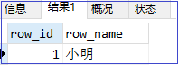

# mysql游标

<!-- toc -->

## 一，什么是游标(cursor)
```
个人觉得就是一个cursor,就是一个标识，用来标识数据取到什么地方了。你也可以把它理解成数组中的下标。
```
## 二，游标(cursor)的特性
```
1,只读的，不能更新的。
2,不滚动的
3,不敏感的，不敏感意为服务器可以活不可以复制它的结果表
游标(cursor)必须在声明处理程序之前被声明，并且变量和条件必须在声明游标或处理程序之前被声明。
```
## 三，使用游标(cursor)
```
1.声明游标
DECLARE cursor_name CURSOR FOR select_statement
这个语句声明一个游标。也可以在子程序中定义多个游标，但是一个块中的每一个游标必须有唯一的名字。声明游标后也是单条操作的，但是不能用SELECT语句不能有INTO子句。
2. 游标OPEN语句
OPEN cursor_name
这个语句打开先前声明的游标。
3. 游标FETCH语句
FETCH cursor_name INTO var_name [, var_name] ...
这个语句用指定的打开游标读取下一行（如果有下一行的话），并且前进游标指针。
4. 游标CLOSE语句
CLOSE cursor_name
这个语句关闭先前打开的游标。
```

```sql
-- cursor 游标，游标的标志
-- 1条sql，对应N条资源，取出资源的接口/句柄，就是游标
-- 沿着游标，可以一次取出1行
-- declare声明，declare 游标名 cursor for select_statement 
-- open 打开：open游标
-- fetch 取值：fetch 游标名 into var1, var2 [...]
-- close 关闭：close游标名
```
## 四，应用举例1
### 4.1 准备
####  4.1.1sql语句
```sql
create table student (id int, uname varchar(50));
insert into student values(1, '小明');
insert into student values(2, '小王');
insert into student values(3, '小东');
insert into student values(4, '小西');
```

### 4.2 实现1
#### 4.2.1 创建存储过程1
```sql
-- 创建存储过程
drop procedure if exists p1;
delimiter $
create procedure p1()
begin 
  -- 变量的声明要在游标之前
  declare row_id int;  -- 声明变量
  declare row_name varchar(50);
  -- 声明游标
  declare getStudent cursor for select id,uname from student;
  -- 打开游标
  open getStudent; 
  -- fetch 的时候，取到的值一定要赋值给定义好的变量
  fetch getStudent into row_id, row_name;
  select row_id,row_name; -- 打印数据
  -- 关闭游标
  close getStudent;
end $
```

#### 4.2.2 执行存储过程1
```sql
-- 执行存储过程
call p1();
```

#### 4.2.3 执行存储过程的结果1


### 4.3 实现2
#### 4.3.1 创建存储过程
```sql
-- 创建存储过程
drop procedure if exists p1;
delimiter $
create procedure p1()
begin 
  -- 变量的声明要在游标之前
  declare row_id int;  -- 声明变量
  declare row_name varchar(50);
  -- 声明游标
  declare getStudent cursor for select id,uname from student;
  -- 打开游标
  open getStudent; 
  -- fetch 的时候，取到的值一定要赋值给定义好的变量
  fetch getStudent into row_id, row_name;
  select row_id,row_name; -- 打印数据
  fetch getStudent into row_id, row_name;
  select row_id,row_name;
  fetch getStudent into row_id, row_name;
  select row_id,row_name;
  fetch getStudent into row_id, row_name;
  select row_id,row_name;
  fetch getStudent into row_id, row_name;
  select row_id,row_name;
  -- 关闭游标
  close getStudent;
end $
```

#### 4.3.2 执行存储过程
```sql
-- 执行存储过程
call p1();
```

#### 4.3.3 执行存储过程的结果


```
错误信息:
[SQL]call p1();
[Err] 1329 - No data - zero rows fetched, selected, or processed
出错原因是:游标已经到头了,无法再获取数据了.
```
### 4.4 实现3：通过循环取出所以数据
#### 4.4.1 存储过程：
```sql
drop procedure if exists p1;
delimiter $
create procedure p1()
begin 
  -- 变量的声明要在游标之前
  declare row_id int;  -- 声明变量
  declare row_name varchar(50);
  declare cnt int default 0;
  declare i int default 0;
  -- 声明游标
  declare getStudent cursor for select id,uname from student;
  select count(*) into cnt from student;
  -- 打开游标
  open getStudent; 
  -- fetch 的时候，取到的值一定要赋值给定义好的变量
  repeat 
    set i:= i + 1;
    fetch getStudent into row_id, row_name;
    select row_id,row_name; -- 打印数据
  until i >= cnt end repeat;

  -- 关闭游标
  close getStudent;
end $

-- 执行存储过程
call p1();
```

#### 4.4.2 结果显示(如果有数据)：


#### 4.4.3 结果显示补充说明：
```
如果 
select id,uname from student;
一行数据都没有取到，那么会出如下报错信息：
[SQL]call p1();
[Err] 1329 - No data - zero rows fetched, selected, or processed
```

### 4.5 实现4：通过循环取出所以数据
#### 4.5.1 存储过程
```sql
drop procedure if exists p1;
delimiter $
create procedure p1()
begin 
  -- 变量的声明要在游标之前
  declare row_id int;  -- 声明变量
  declare row_name varchar(50);
  declare cnt int default 1;
  -- 声明游标
  declare getStudent cursor for select id,uname from student;
  -- 绑定控制变量到游标,游标循环结束自动转cnt = 0
  declare continue handler for NOT FOUND set cnt := 0;
  -- 打开游标
  open getStudent; 
  -- fetch 的时候，取到的值一定要赋值给定义好的变量
  repeat 
    fetch getStudent into row_id, row_name;
    select row_id,row_name; -- 打印数据
  until cnt=0 end repeat;

  -- 关闭游标
  close getStudent;
end $

-- 执行存储过程
call p1();
```

#### 4.5.2 实现结果(如果有数据):
```
会出现多出一条数据。为什么呢??
```


#### 4.5.3 实现结果补充说明:
```
如果 
select id,uname from student;
一行数据都没有取到，那么会出如下信息：
所以需要考虑是否有第一行
```


### 4.6 实现5：通过循环取出所以数据
#### 4.6.1 存储过程
```sql
drop procedure if exists p1;
delimiter $
create procedure p1()
begin 
  -- 变量的声明要在游标之前
  declare row_id int;  -- 声明变量
  declare row_name varchar(50);
  declare cnt int default 1;
  -- 声明游标
  declare getStudent cursor for select id,uname from student;
  -- 绑定控制变量到游标,游标循环结束自动转cnt = 0
  declare continue handler for NOT FOUND set cnt := 0;
  -- 打开游标
  open getStudent; 
  -- fetch 的时候，取到的值一定要赋值给定义好的变量
  fetch getStudent into row_id, row_name;
  repeat 
    select row_id,row_name; -- 打印数据
    fetch getStudent into row_id, row_name;
  until cnt=0 end repeat;
  -- 关闭游标
  close getStudent;
end $
```

#### 4.6.2 运行存储过程
```
D:\mysql-3306\bin>mysql -u root -p
Enter password: ****
Welcome to the MySQL monitor.  Commands end with ; or \g.
Your MySQL connection id is 46
Server version: 5.7.18-log MySQL Community Server (GPL)

Copyright (c) 2000, 2017, Oracle and/or its affiliates. All rights reserved.

Oracle is a registered trademark of Oracle Corporation and/or its
affiliates. Other names may be trademarks of their respective
owners.

Type 'help;' or '\h' for help. Type '\c' to clear the current input statement.

mysql> show databases;
+--------------------+
| Database           |
+--------------------+
| information_schema |
| mybatis            |
| mysql              |
| performance_schema |
| sys                |
+--------------------+
5 rows in set (0.00 sec)

mysql> use mybatis;
Database changed
mysql> drop procedure if exists p1;
Query OK, 0 rows affected (0.04 sec)

mysql> delimiter $
mysql> create procedure p1()
    -> begin
    ->   -- 变量的声明要在游标之前
    ->   declare row_id int;  -- 声明变量
    ->   declare row_name varchar(50);
    ->   declare cnt int default 1;
    ->   -- 声明游标
    ->   declare getStudent cursor for select id,uname from student;
    ->   -- 绑定控制变量到游标,游标循环结束自动转cnt = 0
    ->   declare continue handler for NOT FOUND set cnt := 0;
    ->   -- 打开游标
    ->   open getStudent;
    ->   -- fetch 的时候，取到的值一定要赋值给定义好的变量
    ->   fetch getStudent into row_id, row_name;
    ->   repeat
    ->     select row_id,row_name; -- 打印数据
    ->     fetch getStudent into row_id, row_name;
    ->   until cnt=0 end repeat;
    ->
    ->   -- 关闭游标
    ->   close getStudent;
    -> end $
Query OK, 0 rows affected (0.03 sec)
```
#### 4.6.2 调用存储过程，显示的结果为(有数据的情况)
```
mysql> call p1() $
+--------+----------+
| row_id | row_name |
+--------+----------+
|      1 | 小明     |
+--------+----------+
1 row in set (0.00 sec)

+--------+----------+
| row_id | row_name |
+--------+----------+
|      2 | 小王     |
+--------+----------+
1 row in set (0.00 sec)

+--------+----------+
| row_id | row_name |
+--------+----------+
|      3 | 小东     |
+--------+----------+
1 row in set (0.01 sec)

+--------+----------+
| row_id | row_name |
+--------+----------+
|      4 | 小西     |
+--------+----------+
1 row in set (0.01 sec)

Query OK, 0 rows affected (0.01 sec)
```

#### 4.6.3 调用存储过程，显示的结果为(没有数据的情况)：
```
mysql> call p1() $
+--------+----------+
| row_id | row_name |
+--------+----------+
|   NULL | NULL     |
+--------+----------+
1 row in set (0.00 sec)

Query OK, 0 rows affected (0.00 sec)
```

### 4.7 实现7：通过while循环取出所以数据[实际情况中一般用这种方法]
#### 4.7.1 存储过程,并运行
```sql
drop procedure if exists p1;
delimiter $
create procedure p1()
begin 
  -- 变量的声明要在游标之前
  declare row_id int;  -- 声明变量
  declare row_name varchar(50);
  declare cnt int default 1;
  -- 声明游标
  declare getStudent cursor for select id,uname from student;
  -- 绑定控制变量到游标,游标循环结束自动转cnt = 0
  declare continue handler for NOT FOUND set cnt := 0;
  -- 打开游标
  open getStudent; 
  -- fetch 的时候，取到的值一定要赋值给定义好的变量
  fetch getStudent into row_id, row_name;
  while cnt = 1 do  
    select row_id,row_name; -- 打印数据
    fetch getStudent into row_id, row_name;
  end while;
  -- 关闭游标
  close getStudent;
end $
```

#### 4.7.2 调用存储过程，显示的结果
* 有数据的情况
```
mysql> call p1() $
+--------+----------+
| row_id | row_name |
+--------+----------+
|      1 | 小明     |
+--------+----------+
1 row in set (0.00 sec)

+--------+----------+
| row_id | row_name |
+--------+----------+
|      2 | 小王     |
+--------+----------+
1 row in set (0.00 sec)

+--------+----------+
| row_id | row_name |
+--------+----------+
|      3 | 小东     |
+--------+----------+
1 row in set (0.00 sec)

+--------+----------+
| row_id | row_name |
+--------+----------+
|      4 | 小西     |
+--------+----------+
1 row in set (0.01 sec)

Query OK, 0 rows affected (0.01 sec)
```

* 没有数据的情况
```
mysql> call p1() $
Query OK, 0 rows affected (0.00 sec)
```

## 五. 应用举例2

### 5.1 创建表语插入数据
```sql
   create table PERSON (XH int, XM varchar(50),ZZ varchar(50));
   insert into PERSON (XH,XM) values(1, 'A');
   insert into PERSON (XH,XM) values(2, 'B');
   insert into PERSON (XH,XM) values(3, 'C');
   insert into PERSON (XH,XM) values(4, 'D');
   commit;
   
   create table ADDRESS (XH int, ZZ varchar(50));
   insert into ADDRESS values(2, '北京');
   insert into ADDRESS values(1, '广州');
   insert into ADDRESS values(3, '上海');
   insert into ADDRESS values(4, '西安');
   commit;

   insert into PERSON(XH,XM) values(5, 'E');
   insert into PERSON(XH,XM) values(6, 'F');
   insert into PERSON(XH,XM) values(1, '1A');
   insert into PERSON(XH,XM) values(2, '2B');
   insert into PERSON(XH,XM) values(1, '1AA');
   insert into PERSON(XH,XM) values(3, '1AB');
```


#### 5.2 需求:根据XH的值，把ADDRESS.ZZ 的值写入到PERSON.ZZ中
* 实现方式1：直接用update实现
```sql
-- ----------------直接用update语句实现-------------------
update PERSON P set P.ZZ = (select A.ZZ from ADDRESS A where A.XH = P.XH);
```

* 实现方式2：通过游标的方式实现
```sql
-- ---------------- 用游标的方式实现---------------------
drop procedure if exists useCursor ; 
delimiter //   -- // 转义，创建存储过程开始
create procedure useCursor()  
  begin  
    declare row_XH int;  -- 定义存储过程的变量
    declare row_ZZ varchar(50);  -- 定义存储过程的变量
    declare row_count int default 1;
    declare curl cursor for select XH, ZZ from ADDRESS;  
    declare continue handler for NOT FOUND set row_count := 0;  
    open curl;    -- 打开游标
    fetch curl into row_XH, row_ZZ;
    while row_count = 1 do
        update person set ZZ = row_ZZ where XH = row_XH;
        fetch curl into row_XH, row_ZZ;  
        -- select row_XH, row_ZZ;
    end while;  
    close curl;   -- 关闭游标
  end;//

--  调用存储过程  
call useCursor();
```

#### 5.3 修改表数据
```sql
update person set ZZ ='(广州)1A' where XM = 'A';
update person set ZZ ='(广州)11AA' where XM = '1A';
update person set ZZ ='(广州)111AAA' where XM = '1AA';
insert into person values(1,'CDF','(广州)111AAA');
```

### 5.4 需求: 把表中的"(广州)" 字符去掉
```sql
-- 创建存储过程,并调用该存储过程
drop procedure if exists useCursor ; 
delimiter //   -- // 转义，创建存储过程开始
create procedure useCursor()  
  begin  
    declare temp_ZZ varchar(50);
    declare row_ZZ varchar(50);  -- 定义存储过程的变量
    declare row_count int default 1;
    declare curl cursor for select ZZ from person where ZZ like "%(广州)%";  
    declare continue handler for NOT FOUND set row_count := 0;  
    open curl;    -- 打开游标
    fetch curl into row_ZZ;
    while row_count = 1 do
        set temp_ZZ = substring(row_ZZ,5);
        update person set ZZ = temp_ZZ where ZZ = row_ZZ;
        fetch curl into row_ZZ;
    end while;  
    close curl;   -- 关闭游标
  end;//

--  调用存储过程  
call useCursor();
```