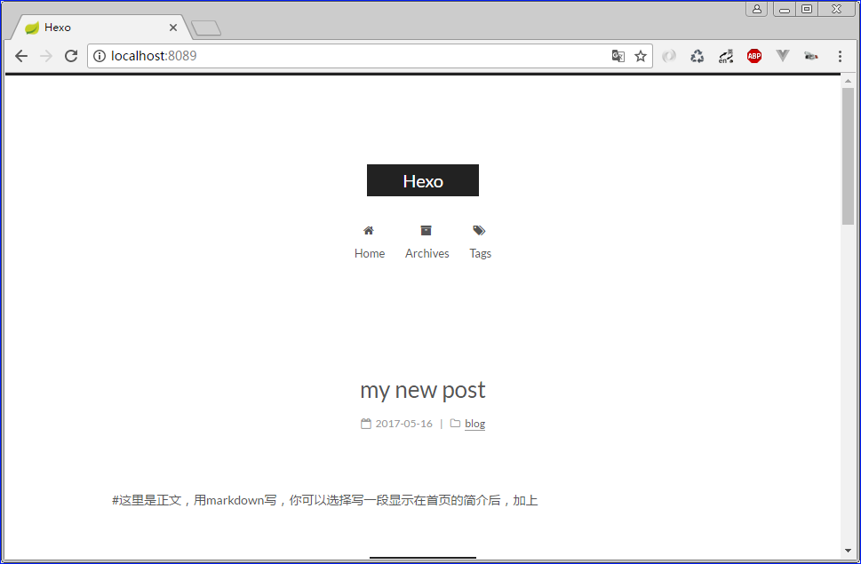
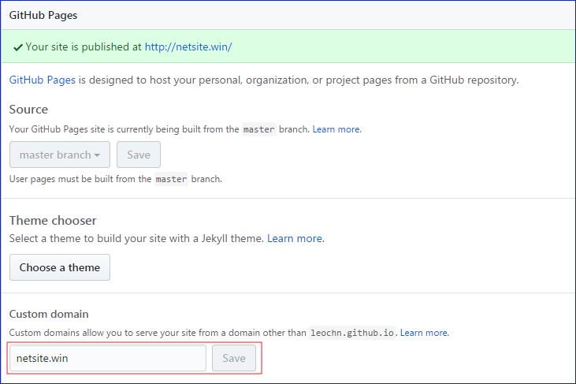
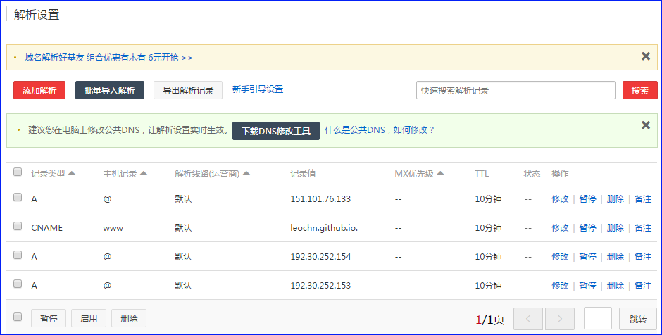

# hexo搭建博客

<!-- toc -->

## 0.准备工作
```
1.node：用来生成静态页面的,到Node.js官网下载相应平台的最新版本,一路安装即可。

2.git: 把本地的hexo内容提交到github上去.

3.github：用来做博客的远程创库、域名、服务器。（~不多说了）

然后你还要知道一点点linux命令，域名解析相关知识（以上条件你都达到了，那么恭喜你30分钟搭建倒计时开始~）
```

## 1 安装Hexo
### 1.1 ```安装hexo-cli:``` 
```
npm install hexo-cli -g
```

### 1.2 可能你会有WARN,但不用担心,这不会影响你的正常使用,然后安装hexo
```
npm install hexo -g
```

### 1.3 hexo版本查看
```
leo@lenovo MINGW64 /d/worksapce-node
$ hexo -v
hexo: 3.3.5
hexo-cli: 1.0.2
os: Windows_NT 10.0.14393 win32 x64
http_parser: 2.7.0
node: 6.10.2
v8: 5.1.281.98
uv: 1.9.1
zlib: 1.2.11
ares: 1.10.1-DEV
icu: 58.2
modules: 48
openssl: 1.0.2k

```

## 2. 创建hexo项目
### 2.1 新建hexo文件夹,并进行init
```
leo@lenovo MINGW64 /d/worksapce-node
$ cd hexo/

leo@lenovo MINGW64 /d/worksapce-node/hexo
$ hexo init
```

### 2.2 安装依赖包
```
cnpm install
```

### 2.3 运行hexo,默认的4000端口可能会被占用,端口修改为8089
```
leo@lenovo MINGW64 /d/worksapce-node/hexo
$ hexo s -g -p 8089
INFO  Start processing
INFO  Hexo is running at http://localhost:8089/. Press Ctrl+C to stop.
```

### 2.3.1 几个hexo常用的命令,#后面为注释
```
hexo g #完整命令为hexo generate,用于生成静态文件
hexo s #完整命令为hexo server,用于启动服务器，主要用来本地预览
hexo d #完整命令为hexo deploy,用于将本地文件发布到github上
hexo n #完整命令为hexo new,用于新建一篇文章
```

### 2.4 运行效果,在本地就可以浏览了


## 3. 发布本地hexo文件到github中
### 3.1 在github中创建hexo仓库


### 3.2 在_config.yml中进行配置
```
# Deployment
## Docs: https://hexo.io/docs/deployment.html
deploy:
  type: git
  repo: git@github.com:leochn/leochn.github.io.git
```

### 3.3 安装hexo-deployer-git自动部署发布工具
```
npm install hexo-deployer-git --save
```

### 3.4 发布到Github
```
   // hexo g  生成静态文件 
   // hexo d  同步到github
   输入如下命令：hexo clean && hexo g && hexo d
```

### 3.5 浏览效果 ```https://leochn.github.io/```


### 3.5 发表一篇文章
#### 3.5.1 在git bash中执行命令 ```hexo new "my new post"```
```
lij01@SH-RAD02-V17 MINGW64 /d/workspace-node/hexo
$ hexo new "my new post"
INFO  Created: D:\workspace-node\hexo\source\_posts\my-new-post.md

lij01@SH-RAD02-V17 MINGW64 /d/workspace-node/hexo
```

#### 3.5.2 用Markdown修改```my-new-post.md```文件
```
---
title: my new post #可以改成中文的，如“新文章”
date: 2017-05-16 09:45:54 #发表日期，一般不改动
categories: blog #文章文类
tags: [文章] #文章标签，多于一项时用这种格式，只有一项时使用tags: blog
---
#这里是正文，用markdown写，你可以选择写一段显示在首页的简介后，加上
<!--more-->，在<!--more-->之前的内容会显示在首页，之后的内容会被隐藏，当游客点击Read more才能看到。
```

#### 3.5.3 效果


## 4. hexo的next主题下载及配置
### 4.1 下载主题
```bash
# 在hexo目录下,git clone git@github.com:iissnan/hexo-theme-next.git themes/next
lij01@SH-RAD02-V17 MINGW64 /d/workspace-node/hexo (master)
$ git clone git@github.com:iissnan/hexo-theme-next.git themes/next
Cloning into 'themes/next'...
remote: Counting objects: 9066, done.
remote: Total 9066 (delta 0), reused 0 (delta 0), pack-reused 9066
Receiving objects: 100% (9066/9066), 12.32 MiB | 3.85 MiB/s, done.
Resolving deltas: 100% (5144/5144), done.
```

### 4.2 修改hexo/_config.yml文件
```
# Extensions
## Plugins: https://hexo.io/plugins/
## Themes: https://hexo.io/themes/
theme: next
```

### 4.3 运行
```
$ hexo s -g -p 8089
```

### 4.4 效果


## 5. hexo的next主题优化
链接: [http://theme-next.iissnan.com/](http://theme-next.iissnan.com/)

## 6. hexo的github站点绑定自己的域名
### 6.1 GitHub Pages 绑定域名
```
http://blog.csdn.net/u013282507/article/details/54944395
```

### 6.2 在仓库里添加CNAME文件(有两总方式)
```
第一种：
  在仓库里添加一个文件,命名为CNAME,文件名大写且没有后缀；文件里填写要绑定的域名且不要包含Http://和www . 如: netsite.win
第二种:
  进入github仓库的Settings,GitHub Pages中找到Custom domain添加域名后保存即可
```



```
对于hexo方式发布的博客,每次hexo d 后,会把CNAME文件删掉
需要手动方式在blog-name/source下添加CNAME文件,输入绑定的域名:netsite.win
```

### 6.3 域名解析
```
我是在阿里云购买的域名,这里以阿里云的操作为例,登陆阿里云,依次进入 控制台-域名与网站(万网)-云解析DNS,找到已购买的域名点击解析按钮,添加如下4项解析.
    A       @     默认  151.101.76.133      --  10分钟        
    CNAME   www   默认  leochn.github.io.   --  10分钟      
    A       @     默认  192.30.252.154      --  10分钟   
    A       @     默认  192.30.252.153      --  10分钟  
其中:
  192.30.252.153 和 192.30.252.154 为github官网的IP.
  151.101.76.133 为leochn.github.io服务的IP,可以通过 ping eochn.github.io 来获取.
  leochn.github.io. 中最后的那个点,不能忘记.
```



## 7. 将hexo博客同时托管到github和coding


## 8. hexo提交搜索引擎(百度+谷歌)


https://www.zhihu.com/question/31377141?sort=created
http://blog.csdn.net/u013282507/article/details/54944395

http://www.joryhe.com/2016-05-29-how_to_create_leancloud_read_Counter.html