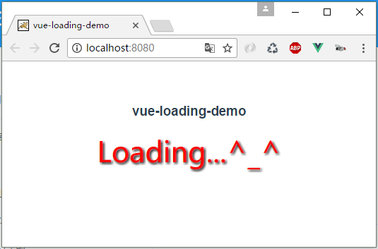
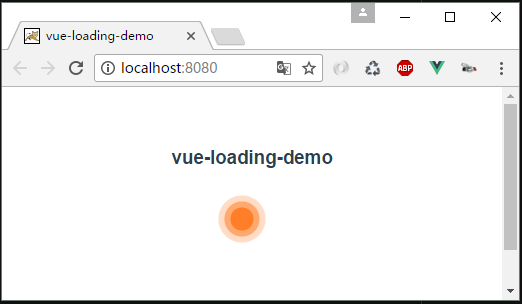

# vue2.0自定义全局组件

<!-- toc -->
## 1. 脚手架生成项目
```
vue init webpack-simple vue-loading-demo
```

## 2.在src目录下,新建components/loading文件夹,目录结构如下
```
|-components
  |-loading
    |-index.js     //导出组件,并且install
    |-Loading.vue  //Loading组件
```

### 2.1 index.js
```js
import LoadingComponent from './Loading.vue'
const Loading = {
    install: function(Vue) {
        //alert(122);
        Vue.component('Loading', LoadingComponent);
        // 这里的Loading,就是mian.js中 import Loader from './components/Loading' 的components下面的Loading
        // 这里的Loading,就是App.vue中使用的组件 <Loading></Loading>
    }
};
export default Loading
```

### 2.2 Loading.vue
```
<template>
    <div class="loading-box">
        {{msg}}
    </div>
</template>
<script>
    export default{
        data(){
            return {
                msg:'Loading...^_^'
            }
        }
    }
</script>
<style scoped>
    .loading-box{
        color: red;
        font-size: 40px;
        font-family: 微软雅黑;
        text-shadow: 2px 2px 5px #000;
    }
</style>
```

## 3. main.js中引入Loading
```js
import Vue from 'vue'
import App from './App.vue'

import Loader from './components/Loading'
Vue.use(Loader)

new Vue({
  el: '#app',
  render: h => h(App)
})
```

## 4. App.vue中使用Loading
```
<template>
  <div id="app" >
    <h3>vue-loading-demo</h3>
    <Loading></Loading>
  </div>
</template>

<script>
export default {
  name: 'app',
  data () {
    return {
      msg: 'Welcome to Your Vue.js App'
    }
  }
}
</script>

<style lang="scss">
#app {
  font-family: 'Avenir', Helvetica, Arial, sans-serif;
  -webkit-font-smoothing: antialiased;
  -moz-osx-font-smoothing: grayscale;
  text-align: center;
  color: #2c3e50;
  margin-top: 60px;
}

h1, h2 {
  font-weight: normal;
}

ul {
  list-style-type: none;
  padding: 0;
}

li {
  display: inline-block;
  margin: 0 10px;
}

a {
  color: #42b983;
}
</style>
```

## 5. 效果


## 6. 创建酷炫组件,来源网络的效果,修改Loading.vue
```
<template>
    <div class="loader">
        <div class="loader-inner ball-scale-multiple">
          <div></div>
          <div></div>
          <div></div>
        </div>
    </div>
</template>

<script>
    //document.
</script>

<style scoped>
    .loader{
        width:80px;
        height: 80px;
        margin:50px auto;
    }


    @-webkit-keyframes ball-scale-multiple {
  0% {
    -webkit-transform: scale(0);
            transform: scale(0);
    opacity: 0; }

  5% {
    opacity: 1; }

  100% {
    -webkit-transform: scale(1);
            transform: scale(1);
    opacity: 0; } }

@keyframes ball-scale-multiple {
  0% {
    -webkit-transform: scale(0);
            transform: scale(0);
    opacity: 0; }

  5% {
    opacity: 1; }

  100% {
    -webkit-transform: scale(1);
            transform: scale(1);
    opacity: 0; } }

.ball-scale-multiple {
  position: relative;
  -webkit-transform: translateY(-30px);
      -ms-transform: translateY(-30px);
          transform: translateY(-30px); }
  .ball-scale-multiple > div:nth-child(2) {
    -webkit-animation-delay: 0.2s;
            animation-delay: 0.2s; }
  .ball-scale-multiple > div:nth-child(3) {
    -webkit-animation-delay: 0.4s;
            animation-delay: 0.4s; }
  .ball-scale-multiple > div {
    background-color: #f60;
    width: 15px;
    height: 15px;
    border-radius: 100%;
    margin: 2px;
    -webkit-animation-fill-mode: both;
            animation-fill-mode: both;
    position: absolute;
    left: 0px;
    top: 0px;
    opacity: 0;
    margin: 0;
    width: 60px;
    height: 60px;
    -webkit-animation: ball-scale-multiple 1s 0s linear infinite;
            animation: ball-scale-multiple 1s 0s linear infinite; }
</style>
```

## 7. 酷炫效果


## 8. 给自定义组件添加点击事件,修改Loading.vue,添加script代码
```
<template>
    <div class="loader" @click="show">
        <div class="loader-inner ball-scale-multiple">
          <div></div>
          <div></div>
          <div></div>
        </div>
    </div>
</template>

<script>
    export default {
        methods:{
            // 给组件添加点击事件
            show:function(){
                alert('helloLoader..........');
            }
        }
    }
</script>
```


