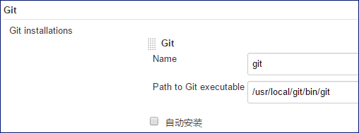
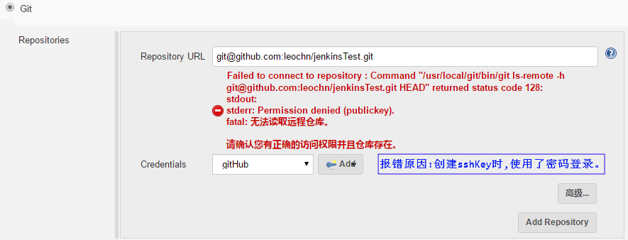

# Jenkins + Git + Maven + Tomcat7自动化构建Java项目

<!-- toc -->

## linux 下安装jenkins
在官网下载```.war``` 文件,并放置到tomcat中即可.

## linux 下安装git
查看centos 7.2安装git2.x版本.[git安装-centos7.2安装git2.x版本](git安装-centos7.2安装git2.x版本.md)
## linux 下安装maven
查看Linux Maven 安装与配置。[maven安装-Linux下Maven安装与配置](maven安装-Linux下Maven安装与配置.md)

## linux 下安装tomcat

## linux 下创建SSH
```bash
// 创建免密码登录 ★★★★★
[root@localhost ~]# ssh-keygen -t rsa -C appchn@163.com
Generating public/private rsa key pair.
Enter file in which to save the key (/root/.ssh/id_rsa): 
Created directory '/root/.ssh'.
Enter passphrase (empty for no passphrase): 
Enter same passphrase again: 
Your identification has been saved in /root/.ssh/id_rsa.
Your public key has been saved in /root/.ssh/id_rsa.pub.
The key fingerprint is:
15:c3:ad:e0:34:7f:a2:08:8b:90:66:bb:d0:e2:84:1a appchn@163.com
The key's randomart image is:
+--[ RSA 2048]----+
|         .o.     |
|        + .o.    |
| .     o +..     |
|oo  .   ..+ .    |
|+o.. o .S. o     |
|Eoo . . .        |
|=o.              |
|.o               |
|                 |
+-----------------+
[root@localhost ~]#
```

## jenkins配置
### 1. 系统设置
* 全局属性设置


### 2. Global Tool Configuration配置
* JKD配置


* GIT配置



* Maven配置


### 3. 证书设置


## Tomcat7 热部署设置
### 1. 修改tomcat7配置
我们需要实现热部署,自然就需要通过maven操作tomcat,所以就需要maven取得操作tomcat的权限,现在这一步就是配置tomcat的可操作权限.

在tomcat的安装目录下,修改conf / tomcat-user.xml文件,在<tomcat-users> 节点下面增加如下配置:
```
<role rolename="manager-gui" />
<role rolename="manager-script" />
<user username="tomcat" password="tomcat" roles="manager-gui, manager-script"/>

```
### 2. 使用maven插件实现热部署
```
需要使用maven的tomcat插件。Apache官方提供的tomcat插件。
使用maven打包——》上传——热部署一气呵成。
Maven的配置：
修改项目的pom.xml文件,在<build> 节点下面增加如下配置:tomcat7的配置
```
```
    <build>
        <plugins>
            <plugin>
                <groupId>org.apache.tomcat.maven</groupId>
                <artifactId>tomcat7-maven-plugin</artifactId>
                <version>2.2</version>
                <configuration>
                    <port>8081</port>
                    <path>/</path>
                    <url>http://192.168.200.133:8081/manager/text</url>
                    <username>tomcat</username>
                    <password>tomcat</password>
                </configuration>
            </plugin>
        </plugins>
    </build>
```
### 3. 热部署
```
热部署之前，修改配置文件中的数据库配置、调用服务的配置为生产环境需要的ip及端口。
执行以下命令：
初次部署可以使用 "tomcat7:deploy" 命令
如果已经部署过使用 "tomcat7:redeploy" 命令

部署跳过测试：
tomcat7:redeploy -DskipTests
```
* Tomcat如何把系统部署到根目录??
```
最直接的方式是:把系统部署到ROOT目录下面就可以了
```

## jenkins 创建任务:mytest
### 源码管理
源码在github中托管: ```git@github.com:leochn/jenkinsTest.git```

在git源码管理中,如果jenkins中的证书不正确会报错:



在git源码管理中,正确的情况如下:


### 构建
增加构建步骤: Invoke top-level Maven targets


## 构建并查看效果
点击构建，并在jenkins控制台中查看效果
```
Started by user leo
Building in workspace /root/.jenkins/workspace/mytest
 > /usr/local/git/bin/git rev-parse --is-inside-work-tree # timeout=10
Fetching changes from the remote Git repository
 > /usr/local/git/bin/git config remote.origin.url git@github.com:leochn/jenkinsTest.git # timeout=10
Fetching upstream changes from git@github.com:leochn/jenkinsTest.git
 > /usr/local/git/bin/git --version # timeout=10
using GIT_SSH to set credentials 
 > /usr/local/git/bin/git fetch --tags --progress git@github.com:leochn/jenkinsTest.git +refs/heads/*:refs/remotes/origin/*
 > /usr/local/git/bin/git rev-parse refs/remotes/origin/master^{commit} # timeout=10
 > /usr/local/git/bin/git rev-parse refs/remotes/origin/origin/master^{commit} # timeout=10
Checking out Revision fe61478ff753119922b3deb232d8c8270e100149 (refs/remotes/origin/master)
 > /usr/local/git/bin/git config core.sparsecheckout # timeout=10
 > /usr/local/git/bin/git checkout -f fe61478ff753119922b3deb232d8c8270e100149
 > /usr/local/git/bin/git rev-list fe61478ff753119922b3deb232d8c8270e100149 # timeout=10
[mytest] $ /usr/local/apache-maven-3.2.5/bin/mvn tomcat7:redeploy
[INFO] Scanning for projects...
[WARNING] 
[WARNING] Some problems were encountered while building the effective model for com.example:jenkinsTest:war:0.0.1-SNAPSHOT
[WARNING] 'build.plugins.plugin.version' for org.apache.tomcat.maven:tomcat7-maven-plugin is missing. @ line 17, column 12
[WARNING] 
[WARNING] It is highly recommended to fix these problems because they threaten the stability of your build.
[WARNING] 
[WARNING] For this reason, future Maven versions might no longer support building such malformed projects.
[WARNING] 
[INFO]                                                                         
[INFO] ------------------------------------------------------------------------
[INFO] Building jenkinsTest 0.0.1-SNAPSHOT
[INFO] ------------------------------------------------------------------------
[INFO] 
[INFO] >>> tomcat7-maven-plugin:2.2:redeploy (default-cli) > package @ jenkinsTest >>>
[INFO] 
[INFO] --- maven-resources-plugin:2.6:resources (default-resources) @ jenkinsTest ---
[WARNING] Using platform encoding (UTF-8 actually) to copy filtered resources, i.e. build is platform dependent!
[INFO] Copying 1 resource
[INFO] 
[INFO] --- maven-compiler-plugin:3.1:compile (default-compile) @ jenkinsTest ---
[INFO] Changes detected - recompiling the module!
[WARNING] File encoding has not been set, using platform encoding UTF-8, i.e. build is platform dependent!
[INFO] Compiling 1 source file to /root/.jenkins/workspace/mytest/target/classes
[INFO] 
[INFO] --- maven-resources-plugin:2.6:testResources (default-testResources) @ jenkinsTest ---
[WARNING] Using platform encoding (UTF-8 actually) to copy filtered resources, i.e. build is platform dependent!
[INFO] skip non existing resourceDirectory /root/.jenkins/workspace/mytest/src/test/resources
[INFO] 
[INFO] --- maven-compiler-plugin:3.1:testCompile (default-testCompile) @ jenkinsTest ---
[INFO] No sources to compile
[INFO] 
[INFO] --- maven-surefire-plugin:2.12.4:test (default-test) @ jenkinsTest ---
[INFO] No tests to run.
[INFO] 
[INFO] --- maven-war-plugin:2.2:war (default-war) @ jenkinsTest ---
[INFO] Packaging webapp
[INFO] Assembling webapp [jenkinsTest] in [/root/.jenkins/workspace/mytest/target/jenkinsTest-0.0.1-SNAPSHOT]
[INFO] Processing war project
[INFO] Copying webapp resources [/root/.jenkins/workspace/mytest/src/main/webapp]
[INFO] Webapp assembled in [859 msecs]
[INFO] Building war: /root/.jenkins/workspace/mytest/target/jenkinsTest-0.0.1-SNAPSHOT.war
[INFO] WEB-INF/web.xml already added, skipping
[INFO] 
[INFO] <<< tomcat7-maven-plugin:2.2:redeploy (default-cli) < package @ jenkinsTest <<<
[INFO] 
[INFO] --- tomcat7-maven-plugin:2.2:redeploy (default-cli) @ jenkinsTest ---
[INFO] Deploying war to http://192.168.200.133:8081/  
Uploading: http://192.168.200.133:8081/manager/text/deploy?path=%2F&update=true
2/4271 KB   
4/4271 KB 
//.....................
4270/4271 KB   
4271/4271 KB   
Uploaded: http://192.168.200.133:8081/manager/text/deploy?path=%2F&update=true (4271 KB at 6048.9 KB/sec)

[INFO] tomcatManager status code:200, ReasonPhrase:OK
[INFO] OK - Undeployed application at context path /
[INFO] OK - Deployed application at context path /
[INFO] ------------------------------------------------------------------------
[INFO] BUILD SUCCESS
[INFO] ------------------------------------------------------------------------
[INFO] Total time: 45.276 s
[INFO] Finished at: 2017-04-06T10:51:28+08:00
[INFO] Final Memory: 19M/45M
[INFO] ------------------------------------------------------------------------
Finished: SUCCES
```


