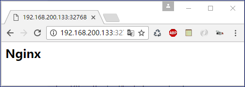

# Docker--镜像与仓库

<!-- toc -->

## 查看和删除镜像

* 镜像的存储地址: /var/lib/docker
```bash
[root@localhost lib]# cd /var/lib/docker
[root@localhost docker]# ll
总用量 16
drwx------ 12 root root 4096 3月   9 22:13 containers
drwx------  5 root root   50 3月   3 14:02 devicemapper
drwx------  2 root root    6 2月  19 14:56 graph
drwx------  3 root root   25 3月   3 12:59 image
drwx------  2 root root   29 2月  19 14:56 init
-rw-r--r--  1 root root 5120 3月   3 08:42 linkgraph.db
drwxr-x---  3 root root   18 3月   3 12:59 network
drwx------  4 root root   30 3月   3 12:58 plugins
-rw-------  1 root root   19 2月  19 14:56 repositories-devicemapper
drwx------  2 root root    6 3月   3 12:59 swarm
drwx------  2 root root    6 3月   3 14:02 tmp
drwx------  2 root root    6 2月  19 14:56 trust
drwx------  2 root root   24 3月   3 12:59 volumes
[root@localhost docker]# docker info
// 可以通过docker info 查看信息
```
* 查看镜像
```
# docker images  // 列出镜像
# docker inspect [OPTIONS] CONTAINER|IMAGE // 镜像信息
# docker rmi [OPTIONS] IMAGE // 镜像信息
```

## 获取和推送镜像(docker 本地镜像和 远程仓库的互动操作)

* 查找镜像
```
# docker search centos 
```
* 拉取镜像
```
# docker pull [OPTIONS] NAME [:TAG]
```
* 推送镜像
```
# docker push NAME [:TAG]
```

## 构建镜像:使用commit


保存对容器的修改,并再次使用;自定义镜像的能力;以软件的形式打包并分发服务及其运行环境.

```
# docker commit // 通过容器构建
# docker build  // 通过Dockerfile文件构建
```

* 使用commit 构建镜像,# docker commit [OPTIONS] CONTAINER [REPOSITORY[:TAG]]
 
```bash
[root@localhost docker]# docker ps -a   //   web 容器是之前安装好nginx的容器
CONTAINER ID        IMAGE               COMMAND                  CREATED             STATUS                      PORTS               NAMES
fb587df3ab6e        centos              "/bin/bash"              32 hours ago        Exited (7) 30 hours ago                         web
eab970bdf4d3        centos              "/bin/sh -c 'while..."   32 hours ago        Exited (137) 32 hours ago                       dc2
14684dccaf8a        centos              "/bin/bash"              32 hours ago        Exited (0) 32 hours ago                         dc1
[root@localhost docker]# docker commit -a 'leo' -m 'centos-nginx' web centos-image-nginx 
sha256:141064f6c5a3f35c7ad0229966b28b4de671c200b1ba8aeea6e1712a6e288ddf
[root@localhost docker]# docker images // 在本机就有两个镜像了
REPOSITORY           TAG                 IMAGE ID            CREATED             SIZE
centos-image-nginx   latest              141064f6c5a3        39 seconds ago      394 MB
centos               latest              67591570dd29        2 months ago        192 MB
[root@localhost docker]# docker inspect centos-image-nginx // 查看镜像的信息
[root@localhost docker]# docker run -p 80 --name nginx -i -t centos-image-nginx /bin/bash
[root@549748f3632e /]# [root@localhost docker]# 
[root@localhost docker]# docker ps
CONTAINER ID        IMAGE                COMMAND             CREATED              STATUS              PORTS                   NAMES
549748f3632e        centos-image-nginx   "/bin/bash"         About a minute ago   Up About a minute   0.0.0.0:32768->80/tcp   nginx
curl: (56) Recv failure: Connection reset by peer
[root@localhost docker]# docker attach nginx
[root@549748f3632e /]# ps -ef
UID        PID  PPID  C STIME TTY          TIME CMD
root         1     0  0 22:39 ?        00:00:00 /bin/bash
root        13     1  0 22:41 ?        00:00:00 ps -ef
[root@549748f3632e /]# cd /usr/local/nginx/sbin
[root@549748f3632e sbin]# ./nginx  //启动nginx服务
[root@549748f3632e sbin]# ps -ef
UID        PID  PPID  C STIME TTY          TIME CMD
root         1     0  0 22:39 ?        00:00:00 /bin/bash
root        17     1  0 22:45 ?        00:00:00 nginx: master process ./nginx
www         18    17  0 22:45 ?        00:00:00 nginx: worker process
root        19     1  0 22:45 ?        00:00:00 ps -ef
[root@549748f3632e sbin]# [root@localhost docker]# 
[root@localhost docker]# curl http://127.0.0.1:32768  //查看nginx是否已经启动服务
<html>
<html lang="en">
<head>
</head>
<body >
    <h2 > Nginx </h2>
</body>
</html>

[root@localhost docker]#
```

在物理机也可以查看到nginx



## 构建镜像:使用Dockerfile

创建Dockerfile文件;使用docker bulid 命令

```
//////
FORM:它的妈妈是谁(基础镜像)
MAINTAINER:告诉别人,你创造了它(维护者)
RUN:你想让它干什么(把命令前面加上RUN)
ADD:COPY文件,会自动解压
WORKDIR:当前工作目录
VOLUME:目录挂载
EXPOSE:端口
RUN:进程要一直运行下去
//////
```

```bash
[root@localhost ~]# mkdir /opt/docker-file
[root@localhost ~]# cd /opt/docker-file/
[root@localhost docker-file]# mkdir nginx
[root@localhost docker-file]# pwd
/opt/docker-file
[root@localhost docker-file]# cd nginx/
[root@localhost nginx]# pwd
/opt/docker-file/nginx
////先准备好需要的资源////
[root@localhost nginx]# wget http://nginx.org/download/nginx-1.11.10.tar.gz
......
[root@localhost nginx]# wget ftp://ftp.csx.cam.ac.uk/pub/software/programming/pcre/pcre-8.39.tar.gz
......
[root@localhost nginx]# vim Dockerfile   //Dockerfile ,D大写
```
* Dockerfile 文件：

```
  1 # This is My first Dockerfile
  2 # Version 1.0
  3 # Author: leo
  4 
  5 #Base images
  6 FROM centos
  7 
  8 #MAINTAINER
  9 MAINTAINER leo
 10 
 11 #ADD
 12 ADD pcre-8.39.tar.gz /usr/local/src
 13 ADD nginx-1.11.10.tar.gz /usr/local/src
 14 
 15 #RUN
 16 RUN yum install -y wget gcc gcc-c++ make openssl-devel
 17 RUN useradd -s /sbin/nologin -M www
 18 
 19 #WORKDIR
 20 WORKDIR /usr/local/src/nginx-1.11.10
 21 
 22 RUN ./configure --prefix=/usr/local/nginx --user=www --group=www --with-http_ssl_module --with-http_stub_status_module --with-pcre=/usr/lo
    cal/src/pcre-8.39 && make && make install
 23 RUN echo "daemon off;" >> /usr/local/nginx/conf/nginx.conf
 24 
 25 ENV PATH /usr/local/nginx/sbin:$PATH
 26 EXPOSE 80
 27 
 28 CMD ["nginx"]
```

* Dockerfile 构建镜像过程

```bash
[root@localhost nginx]# pwd
/opt/docker-file/nginx
[root@localhost nginx]# ll
总用量 2968
-rw-r--r-- 1 root root     641 3月  11 14:06 Dockerfile
-rw-r--r-- 1 root root  967773 2月  14 23:42 nginx-1.11.10.tar.gz
-rw-r--r-- 1 root root 2062258 3月  11 13:52 pcre-8.39.tar.gz
[root@localhost nginx]# docker build -t centos-nginx-file:v1 /opt/docker-file/nginx/
[root@localhost nginx]# docker build -t centos-nginx-file:v1 .  //如果在同一目录,直接用.就可以了.否则需要绝对路径.
//.............................
//.............................
make[1]: Leaving directory `/usr/local/src/nginx-1.11.10'
 ---> 2e0b113c1100
Removing intermediate container 258f0d3c6738
Step 9/12 : RUN echo "daemon off;" >> /usr/local/nginx/conf/nginx.conf
 ---> Running in 7f21c8426a8b
 ---> b676673f76c3
Removing intermediate container 7f21c8426a8b
Step 10/12 : ENV PATH /usr/local/nginx/sbin:$PATH
 ---> Running in 4a9acd7947a8
 ---> daaf20cb6000
Removing intermediate container 4a9acd7947a8
Step 11/12 : EXPOSE 80
 ---> Running in cfe812d17460
 ---> 14f9ffbf1772
Removing intermediate container cfe812d17460
Step 12/12 : CMD nginx
 ---> Running in e911c3074e17
 ---> a8d1298c38a9
Removing intermediate container e911c3074e17
Successfully built a8d1298c38a9
[root@localhost nginx]# docker images
REPOSITORY           TAG                 IMAGE ID            CREATED             SIZE
centos-nginx-file    v1                  a8d1298c38a9        57 seconds ago      391 MB
centos-image-nginx   latest              141064f6c5a3        7 hours ago         394 MB
centos               latest              67591570dd29        2 months ago        192 MB
[root@localhost nginx]# docker run -d -p 99:80 centos-nginx-file:v1    //运行并进行测试
c604169aa96e747103c3e0c0124e070f43dd95ce18393a5e515e437e28e33c5e
[root@localhost nginx]# docker ps
CONTAINER ID        IMAGE                  COMMAND             CREATED             STATUS              PORTS                NAMES
c604169aa96e        centos-nginx-file:v1   "nginx"             19 seconds ago      Up 17 seconds       0.0.0.0:99->80/tcp   stoic_meninsky
[root@localhost nginx]# curl http://127.0.0.1:99
<!DOCTYPE html>
<html>
<head>
<title>Welcome to nginx!</title>
<style>
    body {
        width: 35em;
        margin: 0 auto;
        font-family: Tahoma, Verdana, Arial, sans-serif;
    }
</style>
</head>
<body>
<h1>Welcome to nginx!</h1>
<p>If you see this page, the nginx web server is successfully installed and
working. Further configuration is required.</p>

<p>For online documentation and support please refer to
<a href="http://nginx.org/">nginx.org</a>.<br/>
Commercial support is available at
<a href="http://nginx.com/">nginx.com</a>.</p>

<p><em>Thank you for using nginx.</em></p>
</body>
</html>
[root@localhost nginx]#
```

安装tomcat
```bash
[root@localhost tomcat]# vim Dockerfile 
  1 # This is My first Dockerfile
  2 # Version 1.0
  3 # Author: leo
  4 
  5 #Base images
  6 FROM centos
  7 
  8 #MAINTAINER
  9 MAINTAINER leo
 10 
 11 #ADD
 12 ADD apache-tomcat-9.0.0.M18.tar.gz /usr/local/src
 13 ADD jdk-7u55-linux-i586.tar.gz  /usr/local/src
 14 
 15 ENV PATH /usr/local/jdk1.7.0_55/bin:$PATH
 16 EXPOSE 80
 17 
 18 #启动Tomcat
 19 CMD ["catalina.sh", "run"]
                                                                                                                 
"Dockerfile" 19L, 310C 已写入                                                                       
[root@localhost tomcat]# ll
总用量 145272
-rw-r--r-- 1 root root   9287772 3月   8 23:50 apache-tomcat-9.0.0.M18.tar.gz
-rw-r--r-- 1 root root       310 3月  20 09:09 Dockerfile
-rw-r--r-- 1 root root 139463702 3月  20 09:01 jdk-7u55-linux-i586.tar.gz
[root@localhost tomcat]# docker build -t centos-tomcat-file:v1 .
Sending build context to Docker daemon 148.8 MB
Step 1/7 : FROM centos
 ---> 67591570dd29
Step 2/7 : MAINTAINER leo
 ---> Using cache
 ---> 7a7f5cb74241
Step 3/7 : ADD apache-tomcat-9.0.0.M18.tar.gz /usr/local/src
 ---> Using cache
 ---> cd6331be6891
Step 4/7 : ADD jdk-7u55-linux-i586.tar.gz /usr/local/src
 ---> 152d1c2f46e9
Removing intermediate container 69f5679de556
Step 5/7 : ENV PATH /usr/local/jdk1.7.0_55/bin:$PATH
 ---> Running in 51e74148c054
 ---> 41ccce849364
Removing intermediate container 51e74148c054
Step 6/7 : EXPOSE 80
 ---> Running in 3828487a6f6e
 ---> e6dda5a1ba61
Removing intermediate container 3828487a6f6e
Step 7/7 : CMD catalina.sh run
 ---> Running in c51f000a4ff5
 ---> 9f1718b0e789
Removing intermediate container c51f000a4ff5
Successfully built 9f1718b0e789
[root@localhost tomcat]#
```