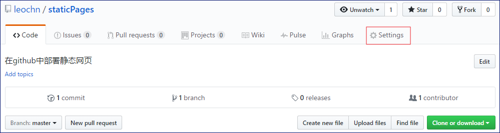
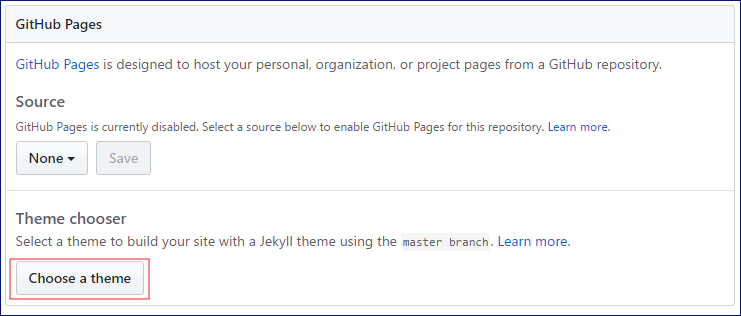
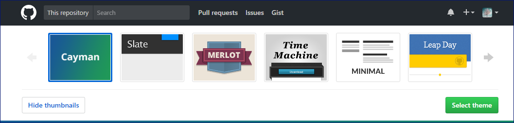
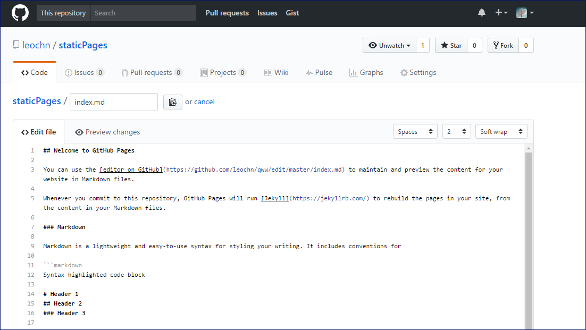
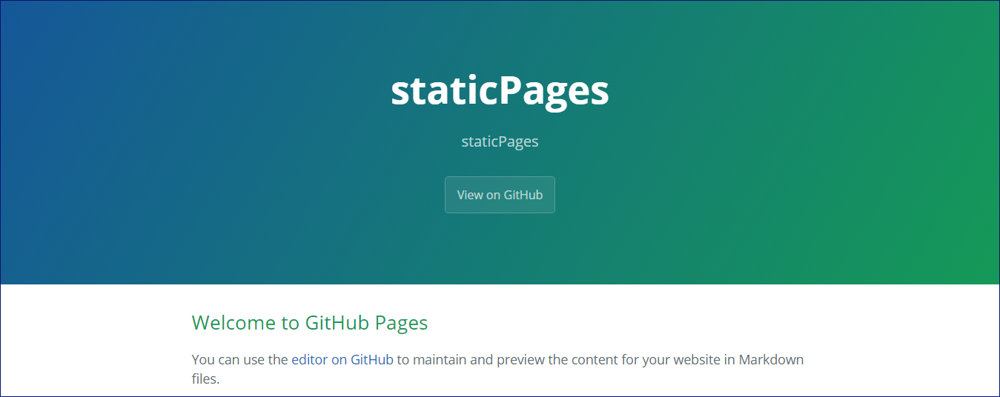
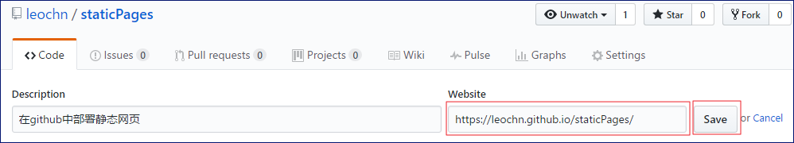
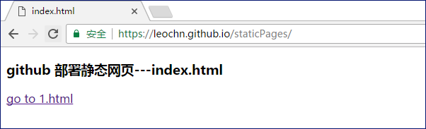

# github 部署静态页面

<!-- toc -->

### 新建版本库

新建仓库，然后点击"Settings"


### 选择主题

这里github给你提供了一些模板，我选了第一个模板，点击"Select theme"

选择好后,默认会提供一个首页,点击 Commit changes



### 访问页面
点击"Settings"，访问刚刚发布的静态页面链接(刚选择的主题)


### 设置访问页面的链接


### 克隆到本地
```
git clone git@github.com:leochn/staticPages.git
``` 

克隆到本地后,只有_config.yml,README.md,index.md 三个文件.

新建index.html, 1.html 页面,并删除_config.yml,index.md文件.删除文件后,默认会以index.html为初始页面.

### 访问自定义页面

